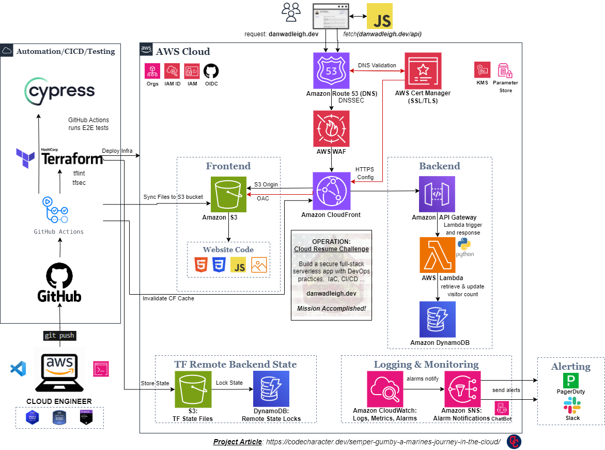
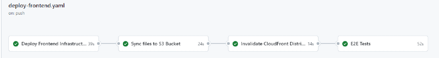
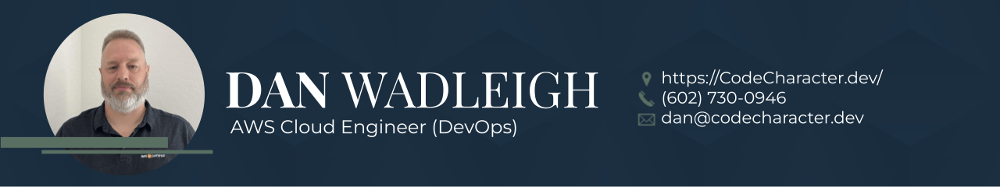

 
Completed project: [Frontend](https://github.com/codecharacter/danwadleigh_dev_frontend) and [Backend](https://github.com/codecharacter/danwadleigh_dev_backend). _(click image to view full size)_

# Cloud Resume Challenge: Frontend
This is the **Frontend** of the ***Cloud Resume Challenge*** project by Forrest Brazeal.  

* ***Project Article***: ["Semper Gumby: A Marine's Journey in the Cloud"](https://codecharacter.dev/semper-gumby-a-marines-journey-in-the-cloud)
    * Project Website: [https://DanWadleigh.dev](https://DanWadleigh.dev)
    * Project Backend Repo: [CRC Backend](https://github.com/codecharacter/danwadleigh_dev_backend)
* The Challenge: [Cloud Resume Challenge - AWS](https://cloudresumechallenge.dev/docs/the-challenge/aws/)
    * DevOps Mod: [Terraform Your CRC](https://cloudresumechallenge.dev/docs/extensions/terraform-getting-started/)

## Project Overview
The challenge was to build a secure full-stack serverless web app in the cloud.  I built my project in AWS and also leveraged Terraform (IaC), GitHub Actions (CI/CD) and Cypress (Testing).

* Terraform Remote Backend Setup
* DNS and SSL Certificate Management
* S3 Static Website Hosting
* AWS CloudFront Distribution
* CI/CD Pipeline with GitHub Actions
    * Terraform deployment & management
    * S3 Sync of Website Code
    * CloudFront Cache Invalidation
    * Cypress End-to-End Testing

## Key Features
* AWS Cloud Serverless with DevOps & Security practices.
* Terraform for infrastructure deployment and management.
* Serverless Frontend-Backend Integration
* Automation with CI/CD pipeline for reliable updates.
* End-to-End Testing of Website
* Monitoring and Alerting notifications

## Tech Stack (Full):
* HTML, CSS, JavaScript   
* IAM (User, Policies) 
* S3 Static Website 
* Amazon CloudFront 
* AWS WAF 
* AWS Certificate Manager 
* Amazon Route 53, KMS  
* Amazon API Gateway 
* AWS Lambda, Python, boto3   
* Amazon DynamoDB 
* Amazon CloudWatch, Amazon SNS, AWS ChatBot   
* PagerDuty, Slack  
* S3, DynamoDB (Remote BE)  
* Terraform (IaC) 
* GitHub Actions (CI/CD) 
* Testing (Cypress) 

## Project Mods

Completed additional DevOps and Security mods recommended for the CRC project.

* **DevOps**
    * Infrastructure-as-Code (IaC): provision & maintain infra with Terrafrom
    * CI/CD: deploy app via GitHub Actions with Cypress tests
    * Monitoring & Alerting: configured CloudWatch Alarms, SNS Topics with integrations to PagerDuty & Slack (AWS Chatbot)
    * Testing: implemented Cypress end-to-end testing upon deployment
* **Security**
    * DNSSEC: configured site domain name to protect DNS setup from potential spoofing
    * IAM Access Analyzer: configured IAM roles with least privileges required
    * Web Application Firewall (WAF): configured WAF web acl rule with CloudFront for both frontend and backend (API Gateway)
    * tfsec: static analysic security scanning of Terraform code in GitHub Actions workflow

## Challenges (Real Learning)

* ACM: take note of us-east-1 locale
* IAM: access advisor vs practical GitHub Actions role permissions (apply before push)
* Remote Backend: create resources > migrate state to S3; s3 config - no vars allowed
* OIDC: create identity provider > then use with GitHub Actions
* State: manual terraform state usage (show, list, remove)
* API Gateway: v1 vs v2 differences; WAF requirements
* Variables/Outputs: referencing between main and modules
* SSM Parameter Store: ability to secure key info and share between projects
* Route 53: DNSSEC - establish chain of trust
* AWS Module: version consistency across project (pin version)
* locals: AWS Account ID
* WAF: CloudFront + API Gateway v2 (HTTP API)
* Docs: AWS & Terraform - growing ability to research and find solutions

## Continuous Improvements

As I continue to learn, I see more opportunities to improve upon the project.  At some point you just have to publish and take the learnings into the next project.

* Tests: add more quality tests
* Monitoring: add more relevant alarms
* WAF: observe and adjust the rules to further secure
* Tagging: add for billing visibility and misc config
* Performance: CI/CD and application in general
* Logging: capture as much info as needed to support
* Misc: code in general - what can be improved upon?

## AWS Well-Architected Framework

* **Operational Excellence**
    * Automated deployments with CI/CD pipeline, monitoring, and continuous improvements.
* **Security**
    * IAM, Certificate Manager (SSL), and S3 bucket policies provide security of access and data.
* **Reliability**
    * S3, DynamoDB, and Route 53 ensure app availability and recoverability.
* **Performance Efficiency**
    * CloudFront provideds efficent content delivery.
* **Cost Optimization**
    * Specific resource (Serverless) provisioning with Terraform minimizes costs.
* **Sustainability**
    * Automation and optimizing AWS services reduce impact.

Resource: [AWS Well-Architected Framework](https://aws.amazon.com/architecture/well-architected/)

## Contact Info

